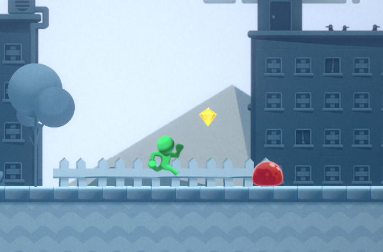

# Platformer Demo Game

The 2D platformer demo project built to showcase clean and modern Unity architecture.  
This example integrates **Zenject (Dependency Injection)**, **UniRx (Reactive Extensions)**, and **UniTask (async/await for Unity)**, using official Unity demo art.

---

## About the Project

This demo game was created for demonstration purposes.  
It’s a classic side-scrolling platformer where the player moves from left to right, collecting tokens and battling enemies.

The main goal is not gameplay complexity, but to demonstrate architecture patterns and best practices for Unity development.

- **Unity version:** 2022.3.59f

---

## Key Features

- Dependency Injection with Zenject – decoupled, testable systems  
- Reactive Input & AI – keyboard, touchscreen, and automated enemy behavior through UniRx  
- Abilities System – modular design for movement, jumping, combat, and token collection  
- State Machine – manages player states and syncs logic with views  
- Vision & Detection – collision, triggers, raycasts, and distance checks  
- Unit Tests – coverage for combat, movement, health, token collection, and more  

---

## Architecture Overview

The project follows a Subject System Architecture:

- **Input** – keyboard/touchscreen input via UniRx  
- **Automatic Behavior** – AI actions like enemy patrols  
- **Configs** – static game design data (speed, jump height, abilities)  
- **Subject Facade** – API exposing subject data to external services  
- **Abilities** – movement, jump, combat logic injected through DI  
- **Views** – minimal rendering and physics-facing interfaces  
- **State Control** – FSM synchronizing logic and views  
- **Vision/Detection** – sensing through collisions, triggers, raycasts  
- **DI Container** – registers and wires up all systems and configs  

---

## Entities

- **Player** – runs, jumps, takes damage, respawns, collects tokens, acts as camera target  
- **Enemy** – patrols paths, deals contact damage, takes damage, dies  
- **Token** – collectible item that triggers progress updates  
- **Round / Progress** – manages level start/end, token tracking, victory conditions  
- **Camera** – follows the player or other targets  
- **Death Zone** – kills entities on entry  
- **Victory Zone** – triggers level completion  
- **Spawn Points** – place player and enemies in the world  

---

## Unit Test Coverage

- CombatResolver – collision & damage rules  
- DeathZoneFacade – instant kill logic  
- MovementController – axis handling, jumps, stops  
- Jump2DGroundedAbility – grounded jump check  
- PatrolPath (+Mover) – patrol pathing  
- PlayerDamageHandler – damage/death reactions for the player  
- EnemyDamageHandler – enemy hit/death with SFX handling  
- HealthAbility – health, lethality, death events  
- SpriteAnimatorService – tick/frame/looping/frequency  
- SpriteAnimatorModel – animation state (frame/time)  
- TokensCollectorHandler – token collection progress via signals  
- TokensCollectorInfo – token progress model  

---

## Project Folder Structure

- **Core/** → Infrastructure, bootstrap, helpers
- **Gameplay/** → Gameplay entities and abilities
- **Model/** → Data models and signals
- **Systems/** → Unified gameplay systems (no one-off implementations)

